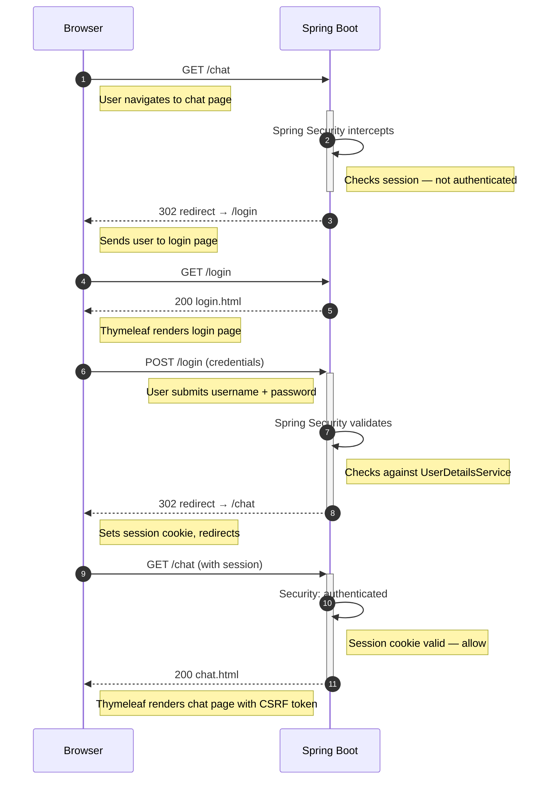
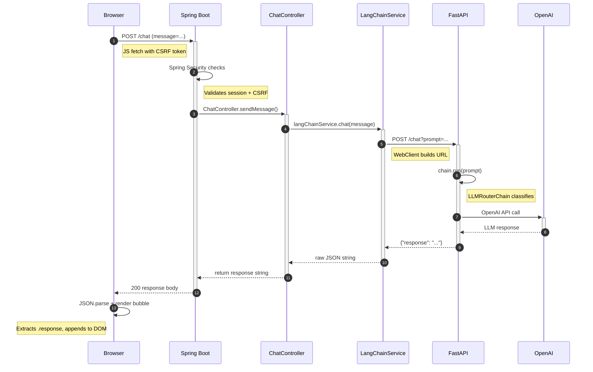

# Hobby AI Concierge

A full-stack AI chatbot with a microservices architecture that routes hobby-related questions to domain-specific expert agents and maintains conversation memory across turns. Built with Spring Boot, LangChain, Docker, and deployed to AWS Elastic Beanstalk.

## Architecture

### Auth Flow



### Chat Flow




---

## Tech Stack

| Layer | Technology |
|-------|-----------|
| Frontend | Google Stitch, Thymeleaf, Tailwind CSS, HTML, JavaScript |
| API Gateway | Spring Boot 4.0, Spring Security |
| AI Service | Python, FastAPI, LangChain, OpenAI GPT-4o-mini |
| Containerization | Docker, Docker Compose |
| Cloud | AWS Elastic Beanstalk, Amazon ECR |
| Build | Maven, pip |


---

## Project Structure

```
hobby-ai-concierge/
├── docker-compose.yml              # Local development
├── aws-deploy/
│   └── docker-compose.yml          # AWS deployment config
├── springboot-app/
│   ├── src/main/java/com/example/springboot_app/
│   │   ├── config/
│   │   │   ├── SecurityConfig.java     # Spring Security setup
│   │   │   └── MvcConfig.java          # View controller mappings
│   │   ├── controller/
│   │   │   └── ChatController.java     # /chat GET + POST endpoints
│   │   └── service/
│   │       └── LangChainService.java   # WebClient proxy to FastAPI
│   ├── src/main/resources/
│   │   ├── templates/
│   │   │   ├── login.html              # Login Page
│   │   │   ├── home.html               # Home Page
│   │   │   └── chat.html               # Chat Page
│   │   └── application.properties      
│   └── Dockerfile
└── langchain-service/
    ├── app/
    │   ├── __init__.py
    │   └── main.py                 # FastAPI + LangChain router
    ├── .env                        # Store API Key here
    ├── requirements.txt
    └── Dockerfile
```

---

## Setup

### Prerequisites

- Python 3.9+
- OpenAI API key - Generate API key from here: https://platform.openai.com/settings/organization/api-keys
- Java 21+


### Installation

Create a virtual environment in the langchain-service folder and install the packages listed in requirements.txt

```bash
cd ./langchain-service
python -m venv venv
source venv/bin/activate
pip install -r requirements.txt
```

### Environment Variables

Create a `.env` file in hobby-ai-concierge/langchain-service:

```
OPENAI_API_KEY=your_openai_api_key_here
```

## Implementation 

### Two Separate Docker Containers


```bash
# Terminal 1 — start FastAPI container
cd hobby-ai-concierge/langchain-service
docker build -t langchain-app .
docker run -p 8000:8000 --env-file .env langchain-app
```

```bash
# Terminal 2 — start Spring Boot
cd hobby-ai-concierge/springboot-app
./mvnw spring-boot:run
```

The app can be accessed at localhost:80

### Single Docker Container using Docker Compose

```bash
cd hobby-ai-concierge
docker-compose up --build
```

The app can be accessed at localhost:80


### Deploy to AWS Elastic Beanstalk

Need to be logged in to your AWS account on AWS CLI

```bash
aws login
```


```bash
aws ecr create-repository --repository-name hobby-ai-concierge/springboot-app --region us-east-1
aws ecr create-repository --repository-name hobby-ai-concierge/langchain-service --region us-east-1
```

Each command will return a JSON response containing a `repositoryUri` that looks like:
```bash
{your_aws_accountID}.dkr.ecr.us-east-1.amazonaws.com/hobby-ai-concierge/langchain-service
{your_aws_accountID}.dkr.ecr.us-east-1.amazonaws.com/hobby-ai-concierge/springboot-app
```

```bash
aws ecr get-login-password --region us-east-1 | docker login --username AWS --password-stdin {your_aws_accountID}.dkr.ecr.us-east-1.amazonaws.com
```

Build and tag both images
```bash
# Build and tag springboot-app
cd hobby-ai-concierge/springboot-app
docker build -t hobby-ai-concierge/springboot-app .
docker tag hobby-ai-concierge/springboot-app {your_aws_accountID}.dkr.ecr.us-east-1.amazonaws.com/hobby-ai-concierge/springboot-app:latest

# Build and tag langchain-service
cd hobby-ai-concierge/langchain-service
docker build -t hobby-ai-concierge/langchain-service .
docker tag hobby-ai-concierge/langchain-service {your_aws_accountID}.dkr.ecr.us-east-1.amazonaws.com/hobby-ai-concierge/langchain-service:latest
```

Push both images to ECR
```bash
docker push {your_aws_accountID}.dkr.ecr.us-east-1.amazonaws.com/hobby-ai-concierge/springboot-app:latest
docker push {your_aws_accountID}.dkr.ecr.us-east-1.amazonaws.com/hobby-ai-concierge/langchain-service:latest
```

In aws-deploy/docker-compose.yml replace the images for langchain-serivce and springboot-app with your images
```bash
langchain-service:
    image: {your_aws_accountID}.dkr.ecr.us-east-1.amazonaws.com/hobby-ai-concierge/langchain-service:latest
springboot-app:
    image: {your_aws_accountID}.dkr.ecr.us-east-1.amazonaws.com/hobby-ai-concierge/springboot-app:latest
```

Zip the aws-deploy/docker-compose.yml file which we will be using to upload to AWS EB while creating an environment
```bash
cd hobby-ai-concierge/aws-deploy
zip ../deploy.zip docker-compose.yml
```

### AWS Console - AWS EB 

1. Open AWS Elastic Beanstalk on AWS Console
2. Select `Create Application`
3. Select `Web Server Environment` and enter application name
4. Platform `Docker` and keep the default selections
5. Select `Upload your code` and `Local file` in Application code and upload the deploy.zip file that we previously created
6. Create Service role and EC2 instance profile if not already created. -- Add the `AmazonEC2ContainerRegistryReadOnly` policy to the `aws-elasticbeanstalk-ec2-role` through IAM -> Roles
7. Select VPC and enable Public IP.
8. Select `us-east-1a` and `us-east-1b` in Instance Subnets
9. In Architecture select `x86_64` or `arm64` based on your local system. This is needed for the compatibility of the Docker images. Apple silicon was used in this demo, so `arm64` was selected.
10. AWS Free tier offers `t3.micro` and `t4g.micro` ec2 instances. So select `t3.micro` and `t4g.micro` respectively for `x86_64` and `arm64`.
11. In `Environment Properties` add Environment Property.
12. With `Plain text` enter `OPENAI_API_KEY` in Name and your API key in Value.
13. Create the environment. This will take a few minutes to deploy.
14. Select the Domain URL and interact with the application as usual.
15. Once done, terminate the environment and also delete the Docker images from AWS ECR.
