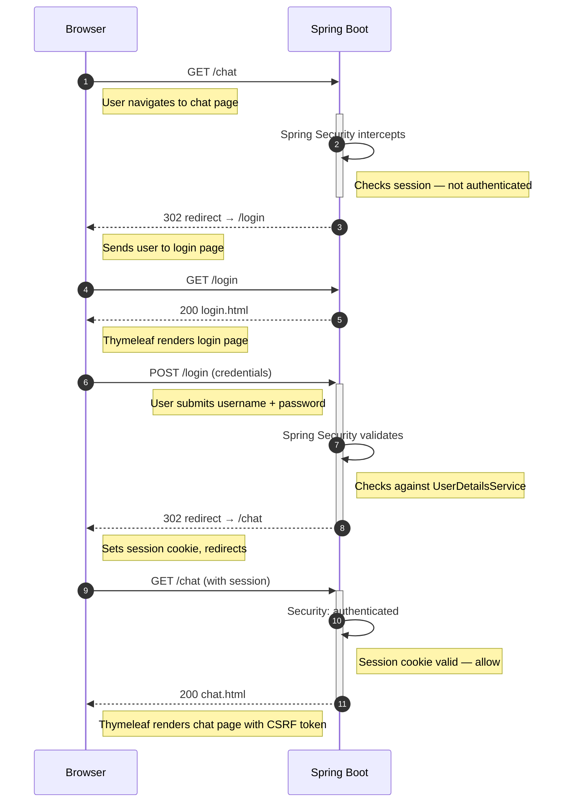
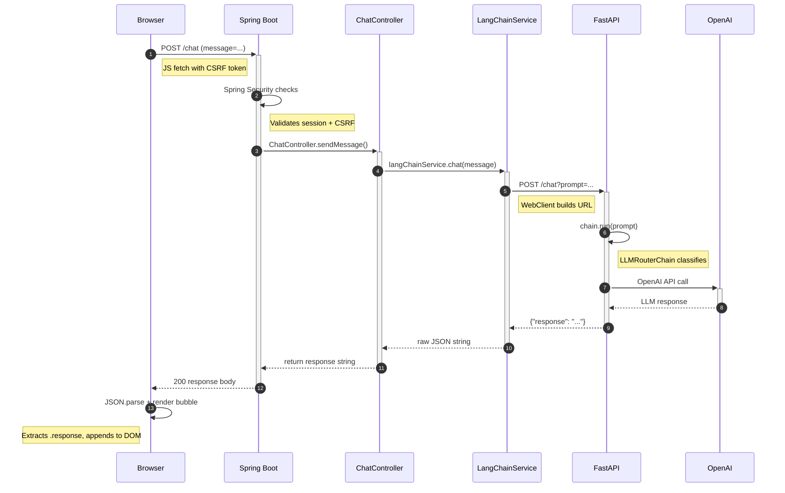

# Hobby AI Concierge

A full-stack AI chatbot with a microservices architecture that routes hobby-related questions to domain-specific expert agents and maintains conversation memory across turns. Built with Spring Boot, LangChain, Docker, and deployed to AWS Elastic Beanstalk.

## Architecture

### Auth Flow



### Chat Flow




---

## Tech Stack

| Layer | Technology |
|-------|-----------|
| Frontend | Google Stitch, Thymeleaf, Tailwind CSS, HTML, JavaScript |
| API Gateway | Spring Boot 4.0, Spring Security |
| AI Service | Python, FastAPI, LangChain, OpenAI GPT-4o-mini |
| Containerization | Docker, Docker Compose |
| Cloud | AWS Elastic Beanstalk, Amazon ECR |
| Build | Maven, pip |


---

## Project Structure

```
hobby-ai-concierge/
├── docker-compose.yml              # Local development
├── aws-deploy/
│   └── docker-compose.yml          # AWS deployment config
├── springboot-app/
│   ├── src/main/java/com/example/springboot_app/
│   │   ├── config/
│   │   │   ├── SecurityConfig.java     # Spring Security setup
│   │   │   └── MvcConfig.java          # View controller mappings
│   │   ├── controller/
│   │   │   └── ChatController.java     # /chat GET + POST endpoints
│   │   └── service/
│   │       └── LangChainService.java   # WebClient proxy to FastAPI
│   ├── src/main/resources/
│   │   ├── templates/
│   │   │   ├── login.html              # Login Page
│   │   │   ├── home.html               # Home Page
│   │   │   └── chat.html               # Chat Page
│   │   └── application.properties
│   └── Dockerfile
└── langchain-service/
    ├── app/
    │   ├── __init__.py
    │   └── main.py                 # FastAPI + LangChain router
    ├── requirements.txt
    └── Dockerfile
```

---
